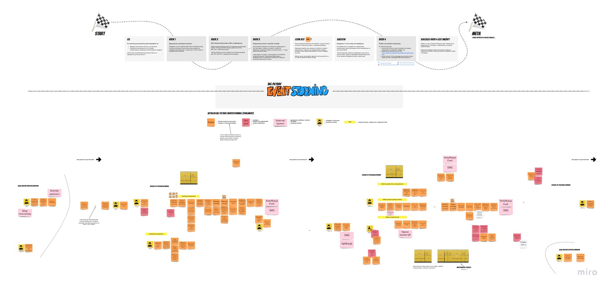

# SKRZYNKOMATY #DomainExplorers

Oryginalny pomysł na ten projekt wyszedł od [Mariusza Gila](https://github.com/mariuszgil/domain-explorers) i jest próbą odpowiedzenia na jego inicjatywę #DomainExplorers

Ciekawą zapowiedzią i punktem wyjścia na początek był film opublikowany na YouTube: [Rozpoznanie domeny z Big Picture EventStorming | Domain Explorers](https://youtu.be/LqIF_pGI3wk)

## O repozytorium

Ten projekt stanowi zapis analizy, modelowania oraz implementacji w ramach [Domain Explorers](https://explorers.bettersoftwaredesign.pl). Znajdziesz tutaj zarówno artefakty wynikowe poszczególnych sesji EventStormingu, modelowania, jak i (docelowo) powstałą na tej bazie implementację (miejmy nadzieję :D).

## Analiza domeny

### Big Picture EventStorming

Pierwsze rozwiązanie - Mikołaj Nowogrodzki i Michał Pawełczyk:

Board w MIRO - [LINK](https://miro.com/app/board/o9J_lU7sET0=/)
